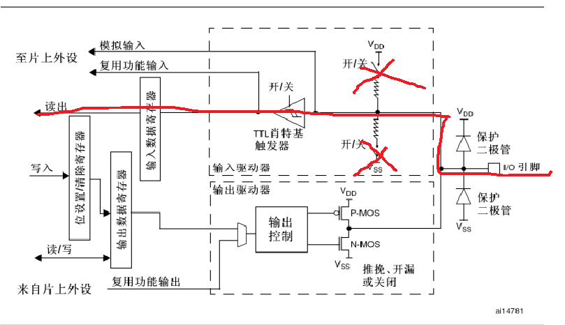

# GPIO基本的配置和工作

## 一、GPIO的基本结构和工作方式

### 1-1：stm32有的GPIO资源

1.GPIO组：就是GPIO所所属的组别，比如GPIOA、GPIOB等等

2.IO端口号：也就是IO所在的IO组的号数，比如GPIOA1,GPIOB1等等

3.stm32f103ze 有A到F个组别，每个组别都有16个端口。不同的芯片型号有不同的情况，但是每个GPIO组都是16个端口

### 1-2：GPIO功能

1.作为不同的GPIO输出

2.复用为其他外设的引脚，比如usart，timer等等

### 1-3：普通GPIO的功能

#### 1-3-1：输入模式

1.输入浮空

2.输入上拉

3.输入下拉

4.模拟输入

#### 1-3-2：输出模式

1.开漏输出

2.开漏复用输出

3.推挽输出

4.推挽复用输出

#### 1-3-2：GPIO的速度

1.什么是GPIO的速度：GPIO电平每秒切换的最大次数, 单纯GPIO意义不大，不过在通讯方面对于GPIO是有要求的。参考资料：[stm32 GPIO速率-CSDN博客](https://blog.csdn.net/Cassiel_Paris/article/details/78701837#:~:text=文章浏览阅读3.3k次。GPIO的输出速率：GPIO电平每秒切换的最大次数%2C 单纯GPIO意义不大，不过在通讯方面对于GPIO是有要求的。,这个输出速率主要体现I%2FO驱动电路的输出反应能力，通过选择不同的输出驱动速率，实现最佳的噪声与和功耗控制。 不难理解，选择输出驱动速率越高，噪声也越大，相应的芯片功耗也会越大。)

2.最大速度：2MHZ 10MHZ 50MHZ

### 1-4：GPIO各种模式的详细解释

GPIO基本结构图

#### 1-4-1：浮空/下拉/上拉输入

1.浮空输入，如图：配置为浮空输入的时候图中红线部分的电路就导通了，我们可以通过读取数据寄存器来判断外部电压，由于是浮空输入所以图上打xx的的俩个开关就不会被导通

2.上拉输入，如图：导通的电路和浮空输入是一样的，但是图像打√的开关就会导通，此时便会被拉到Vdd上去（Vdd是什么自己百度）

3.下拉输入，如图：导通的电路和浮空输入是一样的，但是图像打√的开关就会导通，此时便会被拉到Vss上去（Vss是什么自己百度）

4.模拟输入，如图：复用为模拟输入的话那么此时图上红线的电路便会导通，模拟输入一般用于外设

#### 1-3-2：输出模式

1.推挽输出，如图在推挽输出的模式下，如果我们配置输出高电平，此时输出控制就会让N-MOS截至，P-MOS导通继而输出高电平，返回值则输出低电平。

2.开漏输出，如果配置为输出高电平，此时N-MOS截至，但是P-MOS的电路没有导通，所以最后输出的电平是由于外部电压来决定的，但是配置输出低电平，此时N-MOS会导通，此时就会输出低电平。

3.复用输出就是GPIO作为外设的引脚口了，开漏和推挽都和不同IO性质差不多。

## 二、GPIO的寄存器说明

#### 2-1：GPIOx_CRL寄存器和GPIOx_CRH寄存器

1.CR寄存器的作用：如图用于配置IO的输入输出，上拉下拉

2.为何要用CRL和CRH俩组寄存器，以为一组IO有16个，一个IO要用4位进行配置一共需要64位，但是寄存器只有32位

#### 2-2：GPIOx_IDR和GPIOx_ODR

1.IDR寄存器：用于读取IO的高低电平，一般用于输入模式

2.ODR寄存器：用于控制IO的输出电平

#### 2-3：GPIOx_BSRR 

1.低16位，对其写入0的时候没有影响，写1会将对应的ODR位置为1

2.高16位，对其写入0的时候没有影响，写1会将对应的ODR位置为0

3.关于BSRR和ODR输出高电平的区别：对于BSRR你可以直接写入（比如直接写入1 << 3），但是ODR你要读出来之后再写入，如果直接写入（比如直接写入1 << 3），那么其他的IO就会被置为0，变为低电平。

#### 2-4：GPIOx_BRR

1.功能和BSRR的高16位差不多，不进行赘述

#### 2-5：GPIOx_LCKR

## 三、STM32F10x GPIO说明

### 3-1：IO复用

1.也就是把IO复用为其他外设的引脚口

### 3-2：重映射

1.如图，原本USART1_TX是映射到PA9上面，我们可以重映射到PB6上面去，这部分的内容我们后面会进行讲解

### 3-3：IO可以作为外部中断源

这部分的内容我们后面会进行讲解

## 四、实操

### 4-1：实现跑马灯

#### 4-1-1：思路

1.这个很简单了，就是让LED等灭一段时间然后亮一段时间

#### 4-1-2：硬件原理

1.LED2是一个RGB三色LED二极管，Red接到了BP0,Green接到了PB1，Blue接到了PB5，我们只需要让IO输出电平二极管便会导通。继而实现电灯

#### 4-1-3：基本框架

1.使能GPIOB的时钟

2.配置对于的GPIO为推挽输出

3.输出高低电平

### 4-2：按键输入

1.实现效果：按下按键1红灯亮起，再按一次红的熄灭，反复如此

#### 4-2-1：思路

1.这个也很简单了，按键按下的时候通过读取IO口的高低电平，继而判断是否被按下。

#### 4-2-2：硬件原理

1.如图，便是按键的硬件原理图，KEY1被连接到了PA1上，KEY2被连接到了PG15上,KEY3被连接到了PC13上,KEY4被连接到了PE3上

2.按键没有按下的时候导通的电路如左边，按下的时候右边，也就是说没有按下的时候IO为高电平，按下为低电平

#### 4-2-3：基本框架

1.使能GPIOA的时钟

2.配置对于的GPIOA0为上拉输入

3.读取GPIOA0

**注**：我们按键是需要消抖（[【单片机】按键消抖及原理（硬件和软件方法详解）_Yeah__binbin的博客-CSDN博客](https://blog.csdn.net/yechongbinbin/article/details/114821661)）的这里我们先用delay做一个简单的消抖，等后面定时器学了我们再用定时器做一个比较好的消抖

#### 4-3：源码

**实操4-1的源码在dome下的LED**

**实操4-2的源码在dome下的KEY**
